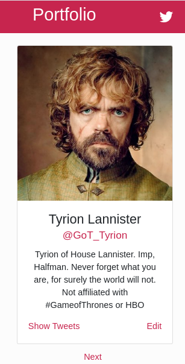
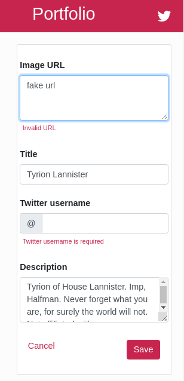
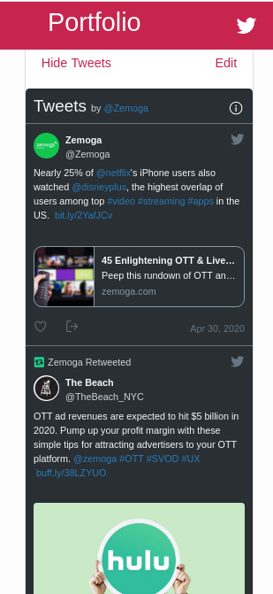
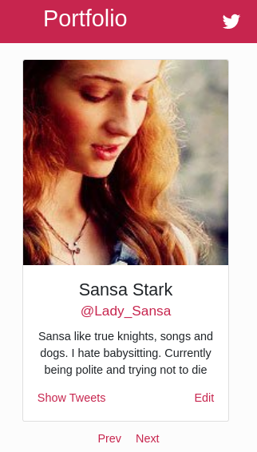
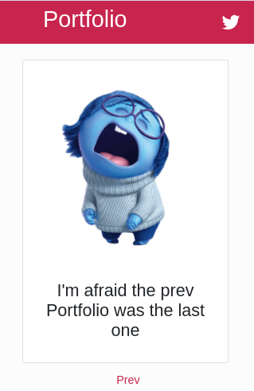

# Zemoga portfolio. Technical test project

## REQUIREMENTS

*  `docker`
*  `docker-compose`
*  `Java 8`

## BACKEND

This backend was written following [DDD](https://en.wikipedia.org/wiki/Domain-driven_design) and [Hexagonal architecture](https://en.wikipedia.org/wiki/Hexagonal_architecture_(software)) approaches.

### Framework and libraries

*  `Spring Boot`
*  `Spring Data JPA`
*  `Spring Web MVC`
*  `Lombok`
*  `Gradle`
*  `JUnit5`
*  `Mockito`
*  `AssertJ`
*  `H2 database`
*  `JaCoCo`
*  `CodeCov`
*  `Swagger`

## Preset database

This project **DOES NOT** execute any migration database script. You **MUST** provide a database schema with a table named `portfolio` and the following structure:

| Field               | Type           | Null   | Key   | Comment                                 |
|---------------------|----------------|--------|-------|-----------------------------------------|
| `idportfolio`       | `bigint`       | `NO`   | `PRI` | A numeric ID                            |
| `description`       | `varchar(255)` | `NO`   |       | Alphanumeric string                     |
| `image_url`         | `varchar(255)` | `NO`   |       | Must be a valid URL                     |
| `twitter_user_name` | `varchar(255)` | `NO`   |       | Alphanumeric string from 1 to 15 length |
| `title`             | `varchar(255)` | `NO`   |       | Alphanumeric string                     |

### Set environment variables

Open `.env` file and edit the following variables:

| Name          | Description                      | Default |
|---------------|----------------------------------|---------|
| `DB_SYSTEM`   | RDBMS that is goint to be used   | `mysql` |
| `DB_SERVER`   | URL of your database server      | n/a     | 
| `DB_PORT`     | Database port to connect to      | `3306`  |
| `DB_SCHEMA`   | The name of your database schema | n/a     |
| `DB_USERNAME` | Database username                | n/a     |
| `DB_PASSWORD` | Database password                | n/a     |

Each of the following steps **MUST** be run from the `root folder` of the project:

### Assemble and test

	cd back
	./gradlew build

**NOTE:** If you don't want to modify the `.env` file, you can set the above environment variables on your host machine and get the same result.

### Run
	docker-compose up --build -d back

**NOTE:** Port `8080` must be available on the host machine.

### Log
	docker-compose logs -f back

### API docs
You will be able to access `Swagger` documentation [here](http://localhost:8080/api/swagger-ui.html).

## FRONTEND

### Framework and libraries

* `Angular 8`
* `Node.js 12`
* `npm`
* `Bootstrap 4`
* `ngx-twitter-timeline`
* `NGINX`

### Run
	docker-compose up -d --build front

**NOTE:** Port `9000` must be available on the host machine.

### Log
	docker-compose logs -f front

### Open web app
You can go to a web browser and access the web page from [here](http://localhost:9000).

### Features

#### Card view
Every record fetched from the database is represented with this view

### Edit mode
It is possible to edit by clicking on `Edit`

### Show Twitter timeline
When you click on `Show Tweets`, it will retrieve the 5 most recent tweets

### Pager
The web app allows you to iterate through all records in the database

If there's no more records to read, this card is shown

## Put services down
	docker-compose down

## Total time to complete the test
        11 hours
